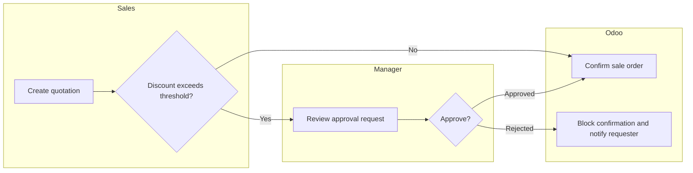

# Process Swimlane Guide

Use this guide when Functional Design needs a To-Be process flow with lanes by department, role, or system.

## Important note

The `add-skill/skills/swimlane-visualization` package is designed for AI workflow observability dashboards, not business-process BPMN or Odoo FSD diagrams. Do not use it directly as the FSD process standard.

Use this Odoo-specific guide instead.

## When to include a swimlane

- the process crosses departments or roles
- there are approval, handoff, exception, or integration steps
- the customer needs sign-off on operational responsibility
- QA needs process-level acceptance criteria

## Lane selection

Prefer lanes such as:

- Sales
- Purchase
- Warehouse
- Accounting
- Manager / Approver
- System / Odoo
- External System
- Customer / Vendor

## Diagram content rules

1. Show business activities, not Python methods or model names.
2. Keep each node short and action-oriented.
3. Show decision points clearly.
4. Mark documents created by the process.
5. Mark integration handoffs and failure/exception paths when relevant.

## Mermaid starter

## DOCX insertion guidance

- Render diagrams to PNG/SVG before inserting into DOCX.
- Add a caption and reference ID.
- Keep the diagram near the process table it explains.
- For very large processes, split into sub-process diagrams instead of shrinking text.
